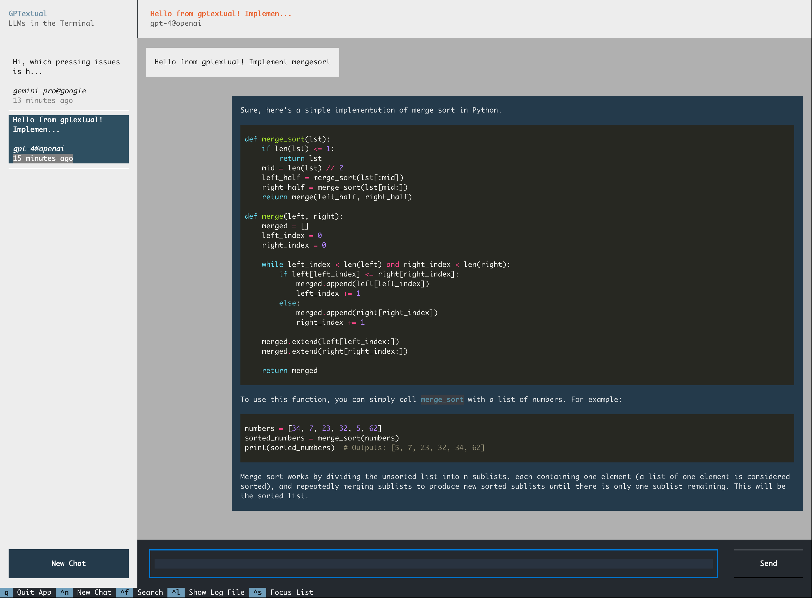

# GPTextual

## A Terminal-Based Chat Client for various LLMs built with [Textual](https://textual.textualize.io/)



### Features

- Locally persisted conversations with LLMs from multiple API providers (OpenAI, Google, SAP, more to come)
- Configurable as to which providers and models you want to chat with
- Multiline text input
- LLM streaming (if the model supports it)
- Search through all conversations and navigate to the exact message you select
- Export conversations to markdown for sharing/archiving
- Conversations are stored as `.parquet` files, so can easily be processed/exported into other formats if required
- Copy messages or only code blocks to clibboard
- LLM Function calling
- Automatic trimming of conversation to the context window size of the LLM (if tokenization model is available)
- Light and Dark theme

### Related Projects and Credits

This project is a fork of the [Elia](https://github.com/darrenburns/elia) project by Darren Burns, with most of the runtime logic and parts of the UI rewritten, especially to decouple the UI from the conversational runtime and to abstract the app from the concrete LLM it should connect to.

This app also integrates [TooLong](https://github.com/Textualize/toolong) as the in-place log file viewer.

The LLMs are called and streamed via [LangChain](https://python.langchain.com/docs/get_started/introduction) API clients.

The connection to SAPs Generative AI Hub is provided by the corresponding [SDK library](https://pypi.org/project/generative-ai-hub-sdk/).

## Installation

#### Prerequisites:
- Tested only with Python >= 3.10

### Steps
1. To avoid any conflicts with other packages or system-wide Python installations, it is recommended to use virtual environments (venv or conda). Create and activate a virtual environment using the following commands (for conda, see documentation):

Change into directory where you want to create the virtual environment. Then:

```bash
python3 -m venv gptextual-env
```

2. Activate:

- On Windows:

```bash
.\gptextual-env\Scripts\activate
```

- On Unix or MacOS:

```bash
source gptextual-env/bin/activate
```

3. Install the package:

```bash
pip install gptextual[all]
```

gptextual can be installed with these flavors:

- `gptextual[openai]` Only the native OpenAI clients will be installed
- `gptextual[google]` Only the native Google GenAI clients will be installed
- `gptextual[sap]` Only the generative ai hub SDK clients by SAP will be installed
- `gptextual[all]` All supported clients in any given release will be installed

This way you can limit your installation footprint if you only want to use native OpenAI, for example.

## Quickstart

### 1. Create file `~/.gptextual/config.yml` and enter your API key for the API provider(s) you want to connect to

```yaml
api_config:
  # Open AI
  openai:
    api_key: <your key>
  
  # Google Gen AI APIs
  google:
    api_key: <your key>

  # SAP Gen AI Hub for enterprise scenarios
  gen-ai-hub:
    client_id: str
    client_secret: str
    auth_url: str
    api_base: str
    resource_group: str
```

If you don't need one or more of the API providers, just remove them from the yaml file.
Other API providers (like Huggingface) will be added soon.

### 2. Start the app by opening a terminal, then:

```bash
gptx
```

Make sure you activated the virtual environment.

## Terminals to use

### On Mac

It is recommended to run `gptextual` with [iTerm2](https://iterm2.com/), because it gives the best user experience. Markdown links in LLM responses will also be fully clickable by holding the Command key and all colors look as intended.

### On Windows

It is recommended to use [Windows Terminal](https://apps.microsoft.com/detail/9N0DX20HK701).

### In VS Code

For developers, the VSCode integrated terminal also renders the app well, markdown links are clickable via the Command key. This gives a nice IDE integration of LLMs for development support.

### More Info

For more info on general settings and optimizations when using Textual based apps, consult the [Textual FAQ](https://textual.textualize.io/FAQ/).

## Using the UI

Textual based apps can be navigated with a mouse or by keyboard only.

It is recommended to learn the key shortcuts and tab orders of the UI elements for the best and most efficient user experience.


# Configuration Guide

In order to use `gptextual` you need to create a YAML file at `~/.gptextual/config.yml` and maintain the configuration for at least 1 API provider (OpenAI, Google, etc.).

**Note: For any configuration changes in the `config.yml` to take effect, an application restart is required.**

## API Providers

The following outlines the mandatory config to get started, the full configuration will be explained further below.

### Open AI

```yaml
api_config:
  openai:
    api_key: <your key> # mandatory

```

### Google

```yaml
api_config:
  google:
    api_key: <your key> # mandatory

```

Configuring both, OpenAI and Google would hence look like this:

```yaml
api_config:
  openai:
    api_key: <your key>
  
  google:
    api_key: <your key>

```

### SAP GenAI Hub

```yaml
api_config:
  gen-ai-hub:
    client_id: str
    client_secret: str
    auth_url: str
    api_base: str
    resource_group: str
```

You will get these settings from your SAP GenAI Hub setup.

`gptextual` will automatically create the required config.json file at `~/.aicore/config.json`.

## Models

For each API provider you can specify which models should be selectable in the app.
This is optional for all API providers except `gen-ai-hub`. 
For OpenAI and Google, default models will be selected, reflecting the models available at the time of the `gptextual` release.

For example:

```yaml
api_config:
  openai:
    api_key: <your key>

    # specify which models you want to chat with
    # the model name has to exist on the API platform
    models: # Examples
      gpt-3.5-turbo:
        context_window: 4096
      gpt-4:
        context_window: 8192
      gpt-4-0125-preview:
        context_window: 128000
```

**Double check the model names since they will be passed to the LangChain API client as-is.**

The `contex_window` parameter is used to 

- automatically default a reasonable value for the maximum number of output tokens requested
- automatically trim the next request to only contain conversation messages that still fit into the context window size

## Function Calling

`gptextual` supports LLM function calling of functions developed by you or provided as python packages you install.

Currently, the following function calling protocols are supported:

- Open AI Tool Calls (New parallel API)
- Open AI Function Calls (Legacy API)

## Configuring Function Calling

### Function Call Support

In the `config.yml` you can configure the type of function call support for each model.
For example, from the [Open AI Website](https://platform.openai.com/docs/guides/function-calling) we see that only a few models support the parallel tool calling API, most of the rest will support the legacy function calling. So we could add the following to the `config.yml`


```yaml
api_config:
  openai:
    api_key: ...
    function_call_support:
      # either listing the models one by one
      gpt-4-turbo-preview: openai_tool
      gpt-4-0125-preview: openai_tool
      # Or using a comma separated list of model names
      'gpt-4-1106-preview,gpt-3.5-turbo-0125,gpt-3.5-turbo-1106': 'openai_tool'

      # or also specify a wildcard meaning "all other models not specified by name'
      '*': openai_function
```
### Registering functions

#### 1. Develop your function in a new pip package and decorate it with the provided function decorator `register_for_function_calling`:

For example:

```python
from gptextual.runtime.function_calling import register_for_function_calling, get_function_config

@register_for_function_calling
def multiply(a: int, a: int):
  """Multiply two integers together.

    Args:
        a: First integer
        b: Second integer
  """
  return a * b


@register_for_function_calling
async def google_web_search(query: str) -> str:
    """
    Executes a Google search with the specified search string and returns the top 10 search results.
    For each result, a title, URL and preview snippet is returned.

    Args:
        query: the query string
    """
    # Functions can also access an optional config from the config.yml
    config = get_function_config(google_web_search)
    api_key, cx_id = None, None
    if config:
        api_key = config.get("api_key", None)
        cx_id = config.get("cx_id", None)
    ...
```

When developing the function, following the guidelines by [LangChain](https://python.langchain.com/docs/modules/model_io/chat/function_calling).

Specifically:
 - Provide the function description for the LLM in the doc string
 - Provide the parameters in the docstring as given in the example


#### 2. Define an entry point with name `gptextual_function` in the `setup.py`/`pyproject.toml` of your project:

```python

entry_points={
        "gptextual_function": [
            "module_name = your.package:your_function"
        ],
},
```

**Note: `gptextual` will only load your entry point, and expect each function to have the decorator above. So specifying one function per module in the entry point is enough, because all functions will be loaded when the module loads.**

#### 3. Configure which functions should be used at runtime

Each function in your python environment that is registered via the decorator and entry point can be used for LLM function calling. In order to actually pick the functions you want to use, you need to list them in the `config.yml`:

```yaml

functions:
  # In this example the function 'google_web_search' will be exposed to LLMs that support function calling
  google_web_search:
    # Functions can also have an optional configuration, in this case Google Cloud API keys
    api_key: ... # API Key
    cx_id: ... # Custom search engine ID

  multiply: {} # empty config
```

### Functions Included with `gptextual`

Currently `gptextual` comes with the following example functions:

- `google_web_search` Executes a google search with your personal Google cloud key and custom search engine ID.

More functions are planned in the future.

## UI Configuration

There is a config section directly related to the textual UI:

```yaml
textual:
  # When LLMs support streaming, this number specifies after how many response chunks
  # a refresh and re-layouting of the chat message will be triggered in the textual framework.
  # A smaller number will give a smoother streaming experience but will lead to more refresh calls.
  refresh_no_stream_chunks: 3

  # gptextual comes with a light and dark theme.
  theme: light|dark
```

## Logging

`gptextual` writes into a JSON-lines log file located at `~/.gptextual/logging/gptextual.jsonl`

The log file can be opened in app with the `Ctrl+L` keyboard shortcut. This will open `TooLong`, which is a very fast, real-time tailing log file viewer.

Inspecting the log can be useful to check if the LLM is called like you expect or to inspect function calling results, for example.

Within `TooLong`, in addition to navigating line by line and searching, you can also navigate via log entry timestamps:

Press:
- `m`: Navigate one minute forward
- `M`: Navigate one minute backward
- `h`: Navigate one hour forward
- `H`: Navigate one hour backward 

### Configuring the log level

By default, `gptextual` sets the log level to `INFO`.

You can change this in the `config.yml` with:

```yaml
# other config...

log_level: DEBUG|INFO|WARNING|ERROR|CRITICAL 
```

## `config.yml` template

A complete `config.yml` for your reference:

```yaml
api_config:
  openai:
    api_key: ... 

    models: # Example: Only want to chat with these 3 models from OpenAI:
      gpt-3.5-turbo:
        context_window: 4096
      gpt-4:
        context_window: 8192
      gpt-4-0125-preview:
        context_window: 128000
      
    function_call_support:
      # onlu activate function calling for GPT-4
      'gpt-4,gpt-4-0125-preview': 'openai_tool'
     
  google:
    api_key: ...
    # No models are specified, gptextual will select 'gemini-pro' by default
  
  # No SAP API specified, so you will not see that option in the UI

textual:
  refresh_no_stream_chunks: 3
  theme: light
  # theme: dark
functions:
  # The gpt-4 models above will be able to call this function!
  google_web_search:
    api_key: ... 
    cx_id: ...

log_level: INFO 
```

# Conversation Storage

The conversations are stored in folder

`~/.gptextual/conversations`

For each conversation, there will be

- a `json` header file containing id, title, timestamp etc
- a `parquet` file containing all conversation messages

The `parquet` file can be read with any library that supports it. `gptextual` uses `polars` internally.


# Markdown Export

When you export a conversation to markdown in the app, they are stored in folder

`~/.gptextual/exports`

# Copying Messages to clipboard

Messages in the chatview are focusable. You see the selected message marked. When a message is selected, you can

- press `c` to copy the whole message text
- press ` (markdown code block char) to copy only the code blocks inside the message (if any)

# Bug Reports

Submit bugs via GitHub issues in this repo.